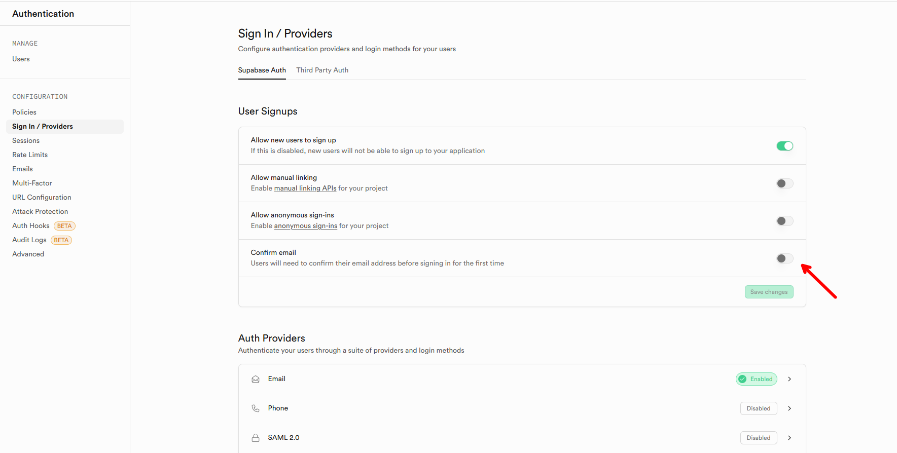
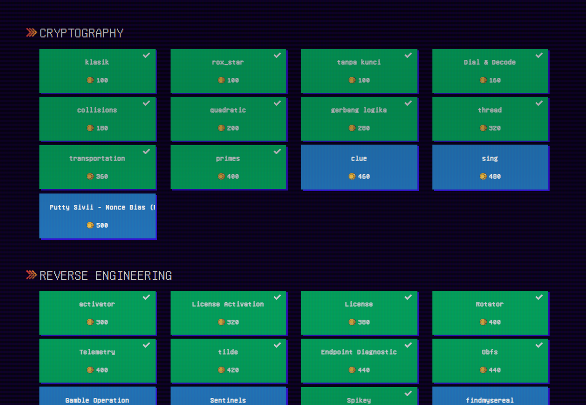
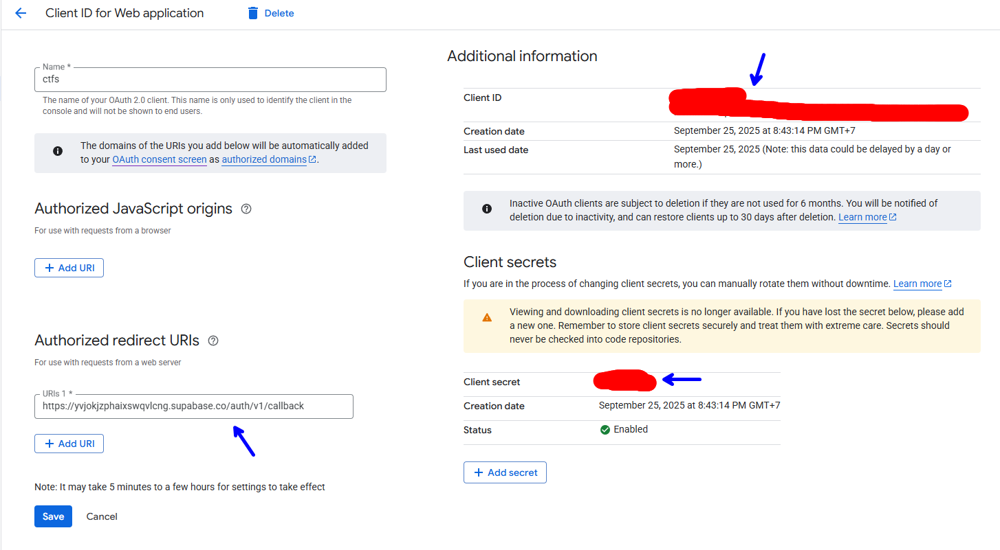
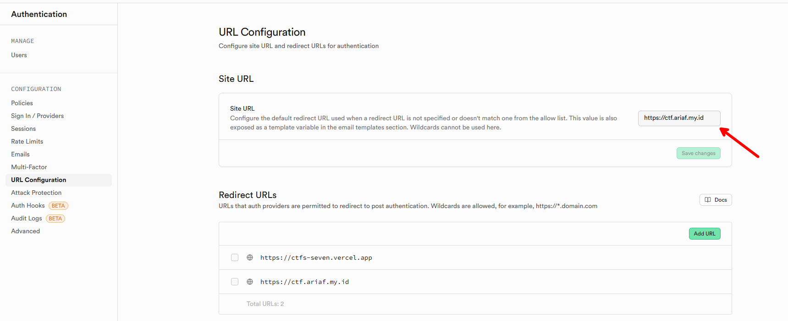

# CTFS (Capture The Flag Simple)

> 🚩 **Free & Simple CTF Platform** — Deploy seamlessly with **Vercel** + **Supabase**. Perfect for individuals or teams who want a free and lightweight CTF platform.

---

## 🎬 Quick Demo


[https://ctf.ariaf.my.id](https://ctf.ariaf.my.id)

## 📖 Deployment Guide

### 1. Clone Repository

```bash
git clone https://github.com/ariafatah0711/ctfs
cd ctfs
```

### 2. Supabase Setup

#### Required

1. **Create Supabase Project**
   Log in to [Supabase](https://supabase.com/) and create a new project.

2. **Import Schema**
   Upload `sql/schema.sql` into the **Supabase SQL editor** and run it to set up the database schema.

3. **Disable Email Confirmation**
   Go to **Authentication** in Supabase and disable email confirmation.
   

#### Optional

4. **Optional Testing Data**

    - Testing challenges → `sql/testing_challenges.sql`
    - Dummy scoreboard → `sql/dummy_scoreboard/`
       - Dummy challenges → `dummy_user_challenges.sql`
       - Dummy solves → `dummy_solves.sql` (can be generated using `create_solves.py` or use the pre-generated file)
       - Reset dummy data → `dummy_reset.sql`

### 3. Environment Configuration

Create a `.env.local` file at the project root:

```env
NEXT_PUBLIC_SUPABASE_URL=your_supabase_url
NEXT_PUBLIC_SUPABASE_ANON_KEY=your_supabase_anon_key
```

Get these values from your Supabase project dashboard.

### 4. Deployment


#### 1. Local Development & Testing

```bash
# Install dependencies
npm install

# Start development server
npm run dev
```

To test your production build:

```bash
# Build for production
npm run build

# (Optional) Preview production build
npm run start
```

> **Tip:**
> After registering a user, you can make them an administrator by setting `admin` to `true` in the Supabase `users` table via the dashboard.



---

#### 2. Deploy to Vercel

##### Using Vercel CLI

```bash
# Install Vercel CLI globally
npm i -g vercel

# Log in to Vercel
vercel login

# Link your project
vercel link

# Set environment variables (can also be done in Vercel dashboard)
vercel env add

# Deploy to production
vercel --prod
```

##### Using Vercel Dashboard

1. Push the project to GitHub.
2. Log in to [Vercel](https://vercel.com/) and import the repository.
3. Set environment variables in Vercel (from `.env.local`).
4. Deploy!

### 5. Authentication Setup (Google Login)

1. **Enable Google Provider in Supabase**
   Dashboard → Authentication → Providers → Google → Enable.
   Enter **Client ID** and **Client Secret** from Google Cloud Console.

2. **Create OAuth Client in Google Cloud Console**

   * APIs & Services → Credentials → Create OAuth Client ID.
   * Application type: **Web**.
   * Authorized redirect URIs:

     ```
     https://<YOUR_PROJECT_REF>.supabase.co/auth/v1/callback
     ```

   

3. **Configure Redirect URL**
   Dashboard → Authentication → URL Configuration → Site URL.
   Set this to your domain, for example:

   ```
   https://ctf.ariaf.my.id
   ```

   

---

## 🗄️ Supabase Backup (GitHub Actions)

Automate daily backup of your Supabase database to GitHub using [matheusbcprog/supabase-backup](https://github.com/matheusbcprog/supabase-backup).

### Setup Steps

1. **Fork or copy the workflow:**
   - Go to [supabase-backup](https://github.com/matheusbcprog/supabase-backup).
   - Copy `.github/workflows/backup.yml` into your repo.

2. **Add required secrets in your GitHub repository:**
   - `SUPABASE_URL` — your Supabase project URL
   - `SUPABASE_SERVICE_ROLE_KEY` — service role key (from Supabase dashboard)
   - `GITHUB_TOKEN` — default GitHub Actions token

3. **Customize schedule (optional):**
   - Edit the `cron` in `backup.yml` to set backup frequency.

4. **Restore:**
   - Backups are saved in your repo under `/backups`. Restore via Supabase SQL editor.

---

## ⚠️ Notes

* If you modify the schema, re-run the Supabase SQL setup and redeploy to Vercel.
* **Warning:** Schema changes may wipe existing data.
* **Backup regularly!**

---
